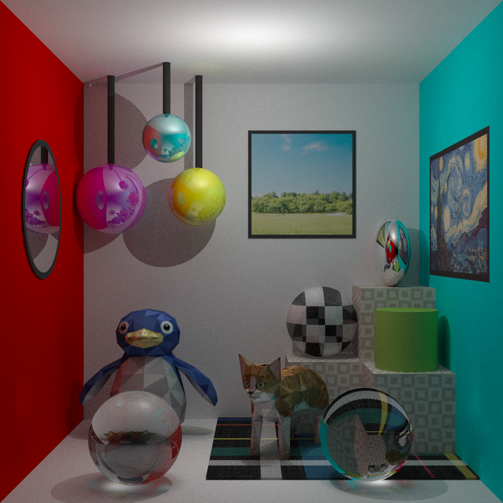

# Path Tracer and Photon Mapping

## Overview

This project implements a path tracer and photon mapping system in C++. It utilizes advanced techniques for simulating realistic lighting, including ray tracing, global illumination, and photon mapping.

<p align="center">
  
</p>


## Features

- **Path Tracing**: Simulates the interaction of light with surfaces to produce photorealistic images.
- **Photon Mapping**: Improves efficiency of global illumination by storing photons in a 3D map and using it to simulate light transport.
- **C++ Implementation**: Optimized for performance and designed for flexibility.
- **CMake Build System**: Easily build the project using CMake for cross-platform compatibility.

## Requirements

- **C++20 or later**: The project uses C++20 features.
- **CMake 3.16 or later**: To configure and build the project.
- **Git**: To clone the repository.

>[!NOTE]
> The project may work with C++17. 
### Prerequisites

Ensure you have the following installed:
- [CMake 3.16+](https://cmake.org/download/) for compilation.
- A C++20-compatible compiler (e.g., GCC, Clang, MSVC)

### Build Instructions

1. Clone the repository:

   ```bash
   git clone https://github.com/yourusername/path-tracer-photon-mapping.git
   cd path-tracer-photon-mapping
    ```
2. Create a build directory:
   ```bash
    mkdir build
    cd build
    ```
3. Run CMake to configure the project.
   ```bash
    cmake ..
    ```
4. Build the project
   ```bash
   cmake --build .
    ```
   
## Usage

In the directory `examples` there are multiple examples of how to execute the **main** program. A typical execution would look something like the following (placed in the root directory `./`):
```bash
.\build\src\main.exe --threads 16 --rays 50 --task-size 512 --bounces 5 --max-depth 1 --file-in ../examples/complete_scene/main_scene_ray_tracing.xml --file-out out/output.ppm
```
where:

- `--threads 16` specifies the number of threads to use for parallel processing.
- `--rays 50` defines the number of rays per pixel.
- `--task-size 512` sets the size of the processing task.
- `--bounces 5` is the number of light bounces.
- `--max-depth 1` is the maximum depth of the binary tree used to store the different (if there are) triangle meshes.
- `--file-in points` to the input XML scene file.
- `--file-out` specifies the output image file in PPM format.

Other configuration such us the algorithm used to render or the resolution must be included in the `.xml` file.

### Output files
After the execution of the command a `.ppm` file is stored in the wanted path. If a `.png` conversion is needed, one can use the following command:

```bash
python  ./lib/PPM_to_PNG_dir <directory-or-path-to-ppm>
```
If a directory is given, every `.ppm` will be converted.

>[!IMPORTANT] 
>Pillow python library is needed. To install it one can use `pip install pillow`. 

## Running Tests with CTest

### List Available Tests

To see a list of all available tests in the project, run the following command in the `build` directory:

```bash
cd build
ctest -N
```
This will display the list of all tests defined in the CMake project without actually executing them.

### Running a Specific Test
To run a specific test, use the following command, replacing <test_name> with the name of the test you want to run:
```bash
ctest -R <test_name>
``` 
For example, to run a test called test_spatial_element, you would use:
```bash
ctest -R test_spatial_element
```

>[!TIP]
> Use the verbose flag `-V` to see a more detailed output of the test.  By default, each test will display its individual output, followed by a summary of the overall test results. Additionally, if any test fails, the expected and actual values will be shown in an *expected-got* pair.
### Running All Tests
To execute all tests in the project, simply use the ctest command without any arguments:
```bash
ctest
```
This will run all the tests defined in the project.

## Metrics Option
In the CMake configuration, the following definition is added:
```CMake
add_definitions(-DMETRICS)
```
This option controls whether the metrics are shown during build time. If -DMETRICS is defined, metrics will be displayed. To disable metrics, simply remove or comment out this line in the CMakeLists.txt file.

## License

This project is licensed under the GNU General Public License v3.0 - see the [LICENSE](LICENSE) file for details.