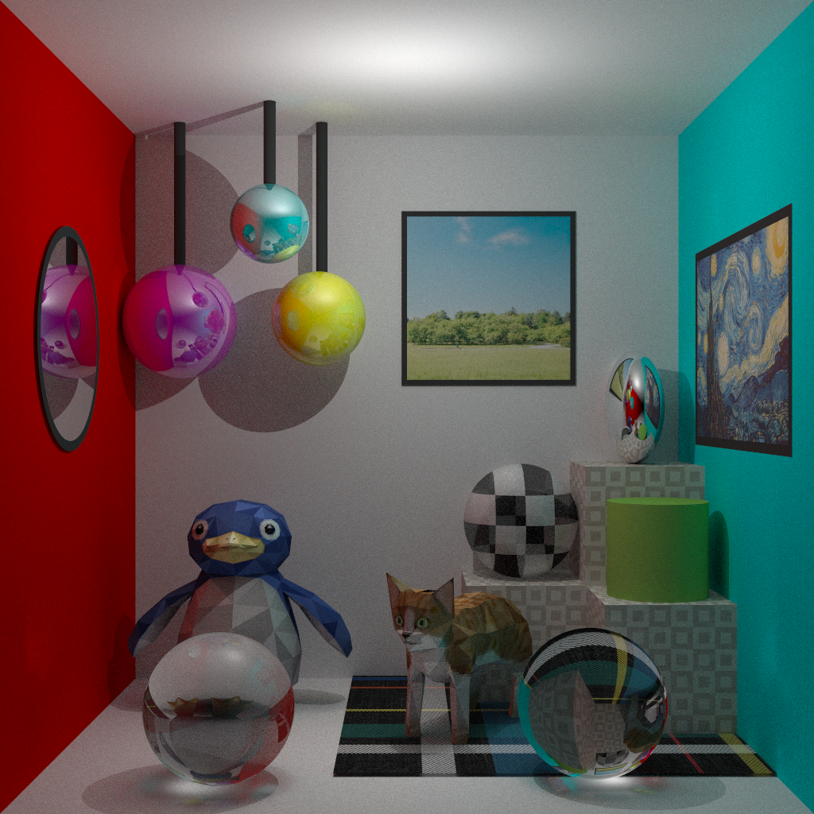

# 🌟 Complete Example

This is a full example of a scene with most of all the implemented features.

<p align="center">
  
</p>

## 🚀 Render It

To render the scene, execute one of the following commands from the root directory (`./`):

### 🎯 Ray-Tracing
To create the scene using the ray-tracing algorithm, run:

```bash
.\build\src\main.exe --threads 16 --rays 50 --task-size 512 --bounces 5 --max-depth 1 --file-in ../examples/complete_scene/main_scene_ray_tracing.xml --file-out out/output.ppm
```
Feel free to adjust the execution flags to suit your needs.

### 💡 Photon-Mapping
To create the scene using photon-mapping, run:

```bash
.\build\src\main.exe --threads 16 --rays 50 --task-size 512 --bounces 5 --max-depth 1 --file-in ../examples/complete_scene/main_scene_photon_mapping.xml --file-out out/output.ppm
```
Feel free to adjust the execution flags to suit your needs.

## 📂 Output Location

The rendered output will be located in assets/out/output.ppm. If you need to convert it to PNG, run the following script:

```bash
python ./lib/PPM_to_PNG_dir.py ./assets/out/output.ppm
```

After execution, the file `assets/out/output.png` will be generated.